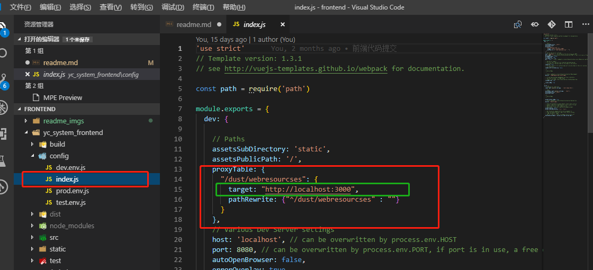
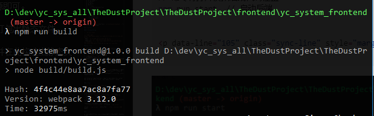
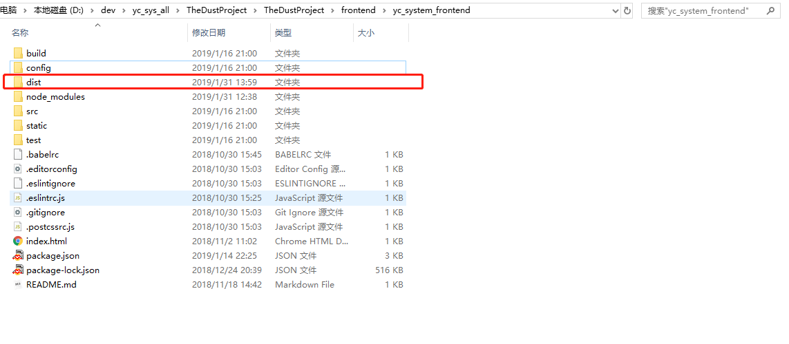

### 文件结构

```
frontend
    ├─yc_system_frontend
    │  ├─build
    │  ├─config
    │  ├─src
    │  │  ├─assets
    │  │  │  └─icons
    │  │  ├─components
    │  │  │  └─charts
    │  │  ├─pages
    │  │  │  └─search
    │  │  └─router
    │  ├─static
    │  │  └─json
    │  └─test
    │      ├─e2e
    │      │  ├─custom-assertions
    │      │  └─specs
    │      └─unit
    │          └─specs
    └─yc_system_mock_backend
        ├─bin
        ├─public
        │  ├─images
        │  ├─javascripts
        │  └─stylesheets
        ├─routes
        └─views
```

```yc-system-frontend```前端代码，```yc-system-mock-backend```,模拟后端代码，供前端调试用。

### linux环境

#### 安装node 和 npm:

- ```cd /usr/local```

- ```sudo  wget https://npm.taobao.org/mirrors/node/v8.9.3/node-v8.9.3-linux-x64.tar.xz ```
- 解压 ```xz -d node-v8.9.3-linux-x64.tar.xz```
- 安装 ```tar -xvf  node-v8.9.3-linux-x64.tar```
- 建立软连接```ln -s /usr/local/node-v8.9.3-linux-x64/bin/node /usr/local/bin/```,```ln -s /usr/local/node-v8.9.3-linux-x64/bin/npm /usr/local/bin/```

#### 克隆代码

- 前端代码地址：https://github.com/nukebomb/yangchesys.git
- 后端代码地址：https://github.com/nukebomb/yc_system_backend.git

1. 新建文件夹，例如：```mkdir usr/dev/```,```cd /usr/dev```,然后```git clone 地址```，
2. 进入模拟后端文件夹，```cd yc_system_backend```
3. ```npm install```，安装项目所需依赖
4. 安装完成后，执行```npm run start```
5. 另外再启动一个命令行终端，
6. 同样的方式,克隆前端代码，进入文件夹```cd yangchesys```,安装依赖```npm install```,
7. 安装完成后，执行```npm run dev```,打开浏览器，输入```http://localhost:8080```

### windows 环境

#### 安装node，npm

node下载地址```https://nodejs.org/zh-cn/```，安装完成后，打开命令行，输入```node -v ```,```npm -v```会出现对应的版本，表明安装成功。

npm镜像设置，因为有可能npm安装以来的时候网速过慢（因为访问国外地址），建议设置(非必须)

```
npm config set registry https://registry.npm.taobao.org --global
npm config set disturl https://npm.taobao.org/dist --global
```

#### 安装git

地址：```https://git-scm.com/downloads```

#### 本地启动

地址： ```https://github.com/nukebomb/TheDustProject```

1. 运行命令行工具，```git clone https://github.com/nukebomb/TheDustProject```,克隆代码
2. 打开文件夹```frontend/yc_system_mock_backend```，命令行输入```npm install```,安装项目依赖，
3. 运行模拟后端，```npm run start```,打开浏览器输入：```http://localhost:3000```,

4.另外重新打开一个命令行窗口，打开文件夹```frontend/yc_system_frontend```，安装依赖:```npm install```

,运行项目```npm run dev```,在浏览器输入```http://localhost：8080```,即可。


#### 部署说明

本部分，请在确定代码克隆成功，并且本地启动（参看本地启动部分）没问题之后使用。
前端的代码编写完成后，需要部署前端项目，实际上，前端会通过打包项目，将前端的项目代码生成只有html,css,jss,和图片等所组成的静态资源。后端部署的时候只需要根据前端打包好的文件结构代理访问对应的静态资源即可。

下面从两个部分说明，1.根据后端地址，修改前端代码的请求地址。

2.打包前端代码生成前端静态资源。

**根据后端地址，修改前端代码的请求地址**
前端的项目编写一直是更具模拟前端而来的，所以在部署项目时，应更改前端的配置文件中的后端目标地址,修改前端代码config文件下的index.js中的proxyTable，将其中的target属性换成真实后端的地址，保存。


**打包前端代码生成前端静态资源**
打包前端项目:
```shell
// 命令行打开模拟前端代码位置
// 打包前端项目
npm run build
```

执行成功后可以在命令行中看到'build complete'，执行过后可以看到前端代码文件夹中多了一个名为dist的文件夹。这个文件夹就是存放打包项目所产生的静态资源的文件夹。


dist 文件夹的文件路径：
```

├─static
│    ├─css
│    ├─fonts
│    ├─img
│    ├─imgs
│    ├─js
│    └─json
└─index.html

```
然后只需在通过配置一个代理服务到dist文件夹，就可以访问前端静态资源了。

